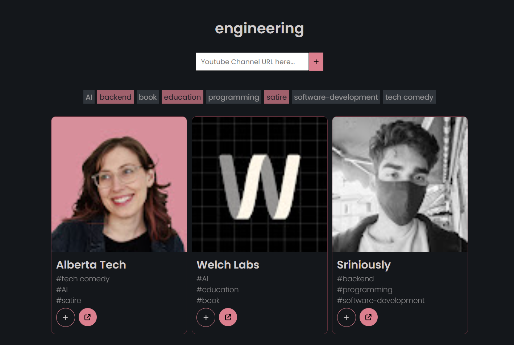
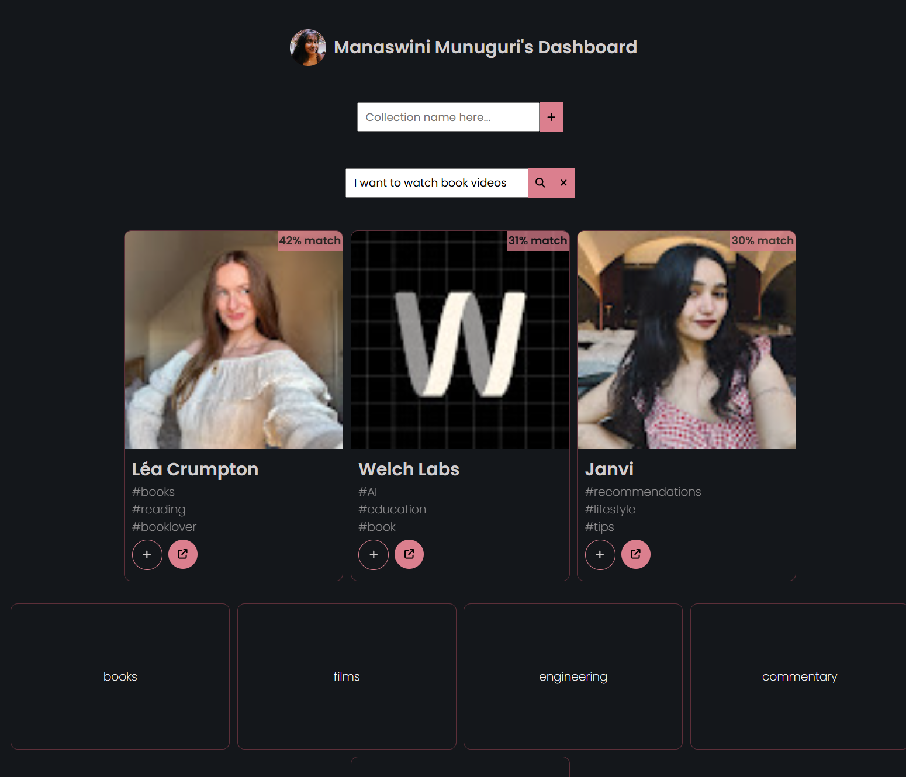

- Site live at : [Link](https://subsorb.in/)
- Writeup at : [Link](https://sharp-robin-caa.notion.site/Subsorb-3671560b222380b9b082f2d7962899b0)
- Feedback form : [Link](https://forms.gle/GenM5argJAZ6NYsZ8)

Subsorb can be used to organize your youtube subscriptions by grouping them into various collections

## Tech stack

- React, Express.js, Node.js, Supabase
- DigitalOcean, NGINX
- Youtube API, OpenAI LLM-integrations & embeddings
- Kafka for async load processing
- Pino for logging

## Features

- Users can create collections of YouTube channels and export them as PDFs
- AI generated summary + tags for each channel
- Searchable tags for filtering within a collection
- User's mood based recommendation system
- Observable backend with Pino
- Lesser write latency with Kafka(channel embedding)

## Screenshots from the app

## Next in the pipeline / Nice to haves

- [x] why isstale when no chan?
- [ ] Update screenshots, video on readme
- [ ] Add otel times -> prometheus -> grafana?
- [ ] ctxt state management of collections, channels to avoid db reads frequently
- [ ] pagination
- [ ] cache makeChan info on redis(?) to avoid db read on addChan retry
- [ ] fallback on optimized tag search if embedding match unsatisfactory(elasticsearch?)
- [x] Export collections as PDF
- [ ] If export collections as shareable web link? implement RBAC
- [x] rewrite collecName as collecID for add route
- [x] message queue to handle openai embedding work - decreases write latency for channels
  - [x] logic
  - [x] install kafka on server
  - [x] get async kafka msg queue code running on server
- [x] add feedback google form
- [ ] better errors like
      body: (...)
      bodyUsed: true
      headers: Headers {}
      ok: false
      redirected: false
      status:429
      statusText:"Too Many Requests"
      type: "cors"
      url: "http://localhost:5000/api/v1/channels"
- [x] observability and reliable console logging on backend
  - [ ] quantify speeds, results, cost
- [ ] remove embedding based recs and add mood based taxonomy classification system instead
- [ ] migrate project to typescript
