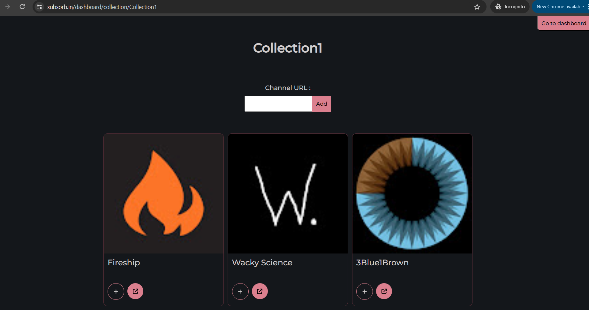

Site live at : [Link](https://subsorb.in/)

Subsorb can be used to organize your youtube subscriptions by grouping them into various collections

<video src='https://github.com/user-attachments/assets/add2cd21-3044-49b1-861f-817e720ea713' width=180></video>

## Tech stack

- React, Express.js, Node.js, Supabase, DigitalOcean, NGINX, Youtube API, OpenAI LLM-integrations & embeddings

## Features and decisions

- MVP
  - Can create collections
  - Can add youtube channels to collections
    - Cached according to last_updated_at timestamp and cleanup after 6months from that to deal with Youtube API quotas
- Other features
  - OpenAI LLM-generated summaries + tags for each channel
  - Channel tags are searchable in each collection
  - User mood based recommendations using OpenAI embeddings + cosine similarity match under the hood
    - Primitive embedding made with ai-summary + tags wasn't a broad enough search space
    - Optimizations I made for providing helpful results to user :
      - Provided richer context(embedding with ai-summary + ai tags + channel name + description)
      - TopK retrieval system with match score percentage shown on every result for better UX
      - If no matches, shows a helpful alert to the user for better UX

## Screenshots from the app

## Next in the pipeline / Nice to haves

- [ ] fallback on optimized tag search if embedding match unsatisfactory(elasticsearch?)
- [ ] quantify speeds, results, cost
