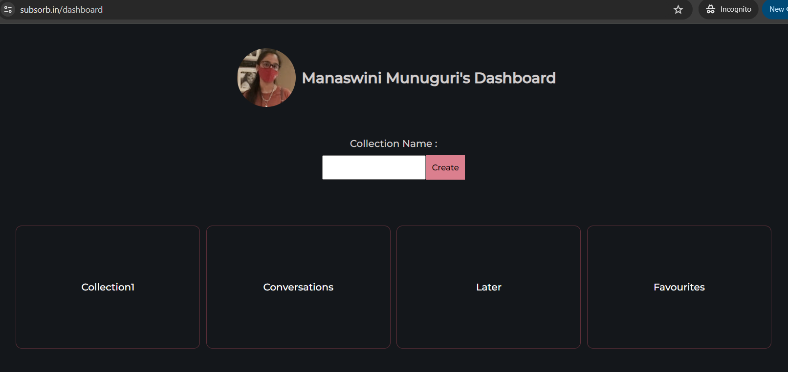
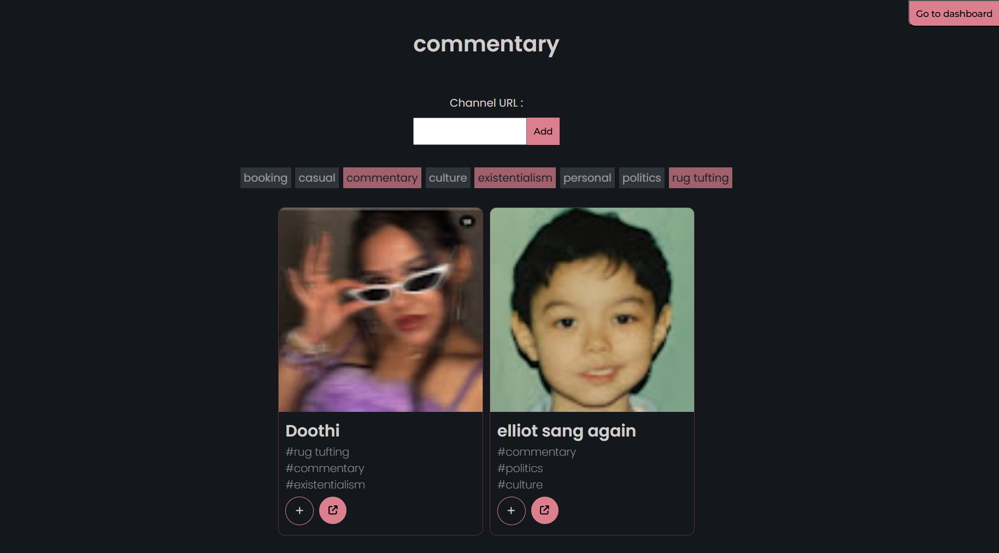
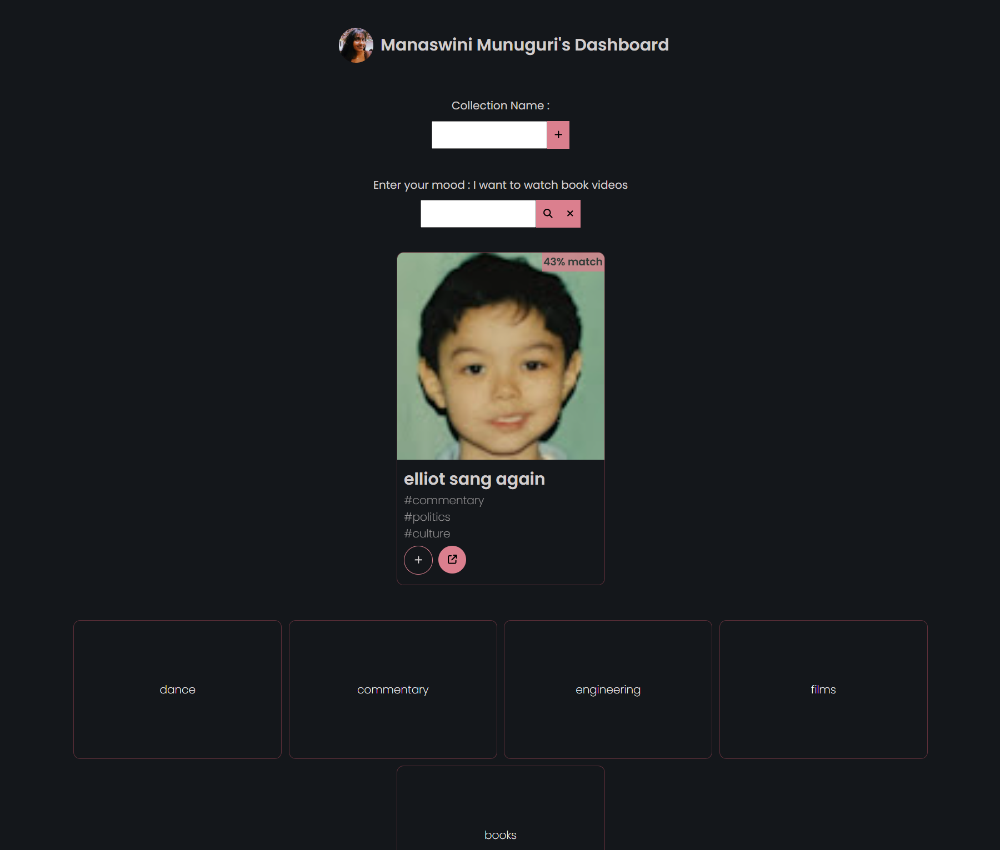

Site live at : [Link](https://subsorb.in/)
Writeup at : [Link](https://sharp-robin-caa.notion.site/Subsorb-3671560b222380b9b082f2d7962899b0)

Subsorb can be used to organize your youtube subscriptions by grouping them into various collections

<video src='https://github.com/user-attachments/assets/add2cd21-3044-49b1-861f-817e720ea713' width=180></video>

## Tech stack

- React, Express.js, Node.js, Supabase, DigitalOcean, NGINX, Youtube API, OpenAI LLM-integrations & embeddings

## Features and decisions

- MVP
  - Can create collections
  - Can add youtube channels to collections
    - Cached according to last_updated_at timestamp and cleanup after 6months from that to deal with Youtube API quotas
- Other features
  - OpenAI LLM-generated summaries + tags for each channel
  - Channel tags are searchable in each collection
  - User mood based recommendations using OpenAI embeddings + cosine similarity match under the hood
    - Primitive embedding made with ai-summary + tags wasn't a broad enough search space
    - Optimizations I made for providing helpful results to user :
      - Provided richer context(embedding with ai-summary + ai tags + channel name + description)
      - TopK retrieval system with match score percentage shown on every result for better UX
      - If no matches, shows a helpful alert to the user for better UX

## Screenshots from the app

Dashboard

Collection page with channels, summaries and their searchable tags

Mood based recommendations

## Next in the pipeline / Nice to haves

- [ ] Export collections as PDF/shareable web link
- [x] rewrite collecName as collecID for add route
- [ ] ctxt state management of collections, channels to avoid db reads frequently
- [ ] pagination
- [ ] background worker handles openai embedding work
- [ ] cache makeChan info on redis(?) to avoid db read on addChan retry
- [ ] fallback on optimized tag search if embedding match unsatisfactory(elasticsearch?)
- [ ] quantify speeds, results, cost
- [ ] migrate project to typescript
- [ ] better errors like
      body: (...)
      bodyUsed: true
      headers: Headers {}
      ok: false
      redirected: false
      status:429
      statusText:"Too Many Requests"
      type: "cors"
      url: "http://localhost:5000/api/v1/channels"
- [ ] observability and reliable console logging on backend
- [ ] remove embedding based recs and add mood based taxonomy classification system instead
